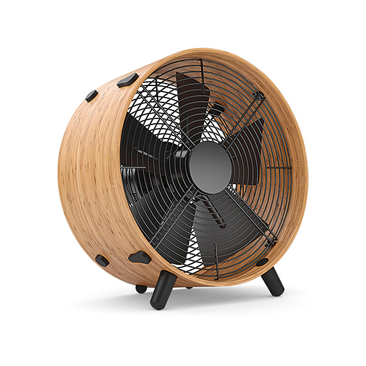

---

layout: yandex2

style: |
    /* собственные стили можно писать здесь!! */
---

# {:.logo}

## {{ site.presentation.title }}
{:.title}

## Откуда

*Saint TeamLead Conf 2022*

*Как и зачем управлять знаниями*

## Зачем?

* Продаем не часы, а [ожидаемое] использование знаний
* Процесс интеллектуальной/креативной работы есть на самом деле процесс создания, накопления и использования знаний
* Управление знаниями — системная сквозная функция для команд, занимающихся интеллектуальным трудом

## Быстрый наброс 1, Вопросы

*Защита проекта накопления знаний по сути является продажей* 

Вопросы:
* как посчитать сколько теряем
* как выбрать что требует накопления
* как посчитать срок окупаемости
* а можно подешевле? (c)

## Быстрый наброс 1, Ответы

*Защита проекта накопления знаний по сути является продажей*

Ответы:
* Трекер, логировать в отдельную задачу, просуммировать по всем задачам = X
* Выбрать очевидные требования (как стандарт для индустрии) + провести опрос, посчитать тупо по количеству символов = Y 
* ?
* Технические писатели аналитики, а не разработчики. Либо, внутренне обучение разработчиков и менеджеров

## Контакты
{:.contacts}

<!-- разделитель контактов -->
-------

<!-- center -->

- {:.github} bankiru

<!-- right -->
